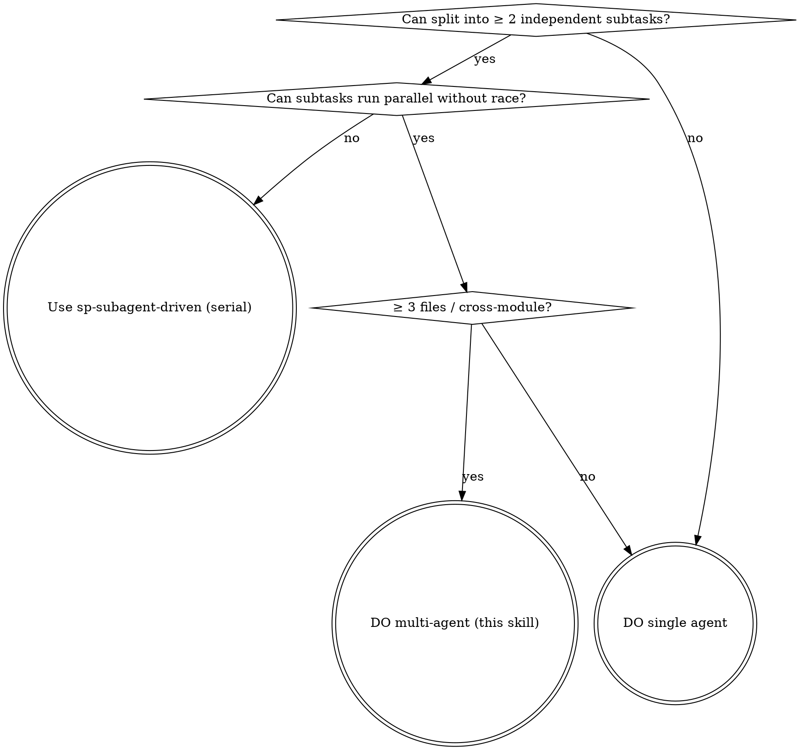

# Multi-Agent Orchestration

整合 3 处分散规范：
- codingsys `~/.claude/CLAUDE.md` 的"多 Agent 并行" + "调度 Codex 做开发"段
- `sp-dispatching-parallel-agents` skill（superpowers）
- `sp-subagent-driven-development` skill（superpowers）

---

## 触发判断（决策树）

任务进来先问 3 个问题：



**简化**：3 个 yes → 走多 agent；任一 no → 退化到单 agent 或串行。

---

## 6 步流程

### Step 1: 拆任务 + 声明 file scope

每个子任务一行 markdown：

```markdown
**子任务 A** (agent: codex)
- 改动文件: backend/foo.py, backend/tests/test_foo.py
- 不准动: backend/bar.py（B 的范围）
- 依赖: 无（可与 B 并行）

**子任务 B** (agent: claude-general-purpose)
- 改动文件: backend/bar.py
- 不准动: backend/foo.py
- 依赖: A 完成后跑回归
```

**关键**：file scope 显式列 + "不准动"。两 agent 改同一文件 = race + merge 灾难。

### Step 2: 选 agent 类型

按 codingsys CLAUDE.md 规范 + 实践：

| 任务类型 | 默认 agent | Fallback |
|---------|-----------|---------|
| 代码 review / 第二意见 | **opus 4.7** | claude-general-purpose |
| 独立模块开发（前后端 / 多 slice） | **codex** | claude-general-purpose |
| 大段重构 / rename / API 迁移 | **codex** | claude-general-purpose |
| 生成单测覆盖（已有 production 代码） | **codex** | claude-general-purpose |
| 算法 / 纯逻辑函数 | **codex** | claude-general-purpose |
| UI 操作 / windows-mcp / 真 GUI E2E | **主线程亲跑** | （子代理无 MCP 权限） |
| 探索性调试（写一段→跑测试→再写） | **主线程** | （上下文打包反而慢） |
| 当下决策连贯的小修改 | **主线程** | （派出去切换成本高） |

**codex 调度先决条件**：`which codex` 必须命中。
- 命中 → 用 codex（按 codingsys CLAUDE.md 默认偏好，用户 2026-04-26 显式授权）
- 未命中 → fallback claude-general-purpose，不报错不问

### Step 3: 创 git worktree（默认）

```bash
# 主目录 G:/projects/<repo> 不动；每个 agent 一个 worktree
git worktree add ../<repo>-task-a -b feat/<task-a>
git worktree add ../<repo>-task-b -b feat/<task-b>
```

worktree 隔离的好处：
- ✅ A B 同时改不同文件 0 风险
- ✅ 各自跑测试不互相干扰（端口除外，见下）
- ✅ merge 失败可单独 rebase / squash
- ⚠️ 创建 ~ 30s（一次性成本）
- ⚠️ 端口冲突：DeskPet 项目用 `scripts/dev-worktree.ps1` 注入
  `DESKPET_BACKEND_PORT=8200/8300/...` 避免

**不走 worktree 的场景**：纯文档改 / 单文件 hotfix / 子任务 < 30 行。

### Step 4: 写 Sprint Contract

每个 agent 派单前必须写：

```markdown
# Sprint Contract — <task name>

## 输入
- spec 路径: <path>
- plan 路径: <path>
- 现有代码锚点: <file:line>

## 输出（验收标准）
- 改动文件清单: <list>
- 必须通过的测试: `pytest backend/tests/test_foo.py` 0 failed
- 必须新增的文件: <list>

## 边界（不准动）
- 不准改: <list>
- 不准 push（主线程统一 merge + push）
- 不准 git commit --no-verify
- 不准 git push --force

## 失败上报
任何环境不就位 / 测试不绿 / 边界冲突 → 立即报 "BLOCKED: <reason>" 退出。
不允许"我尽量"/"差不多"。
```

### Step 5: 派 agent

**并行 (≥ 2 独立 agent)**：单 message 内多个 `Agent` tool call

```
<call: Agent A>
<call: Agent B>
<call: Agent C>
```

Claude Code 自动并发跑。每个 agent 用 `run_in_background: true` 异步收。

**串行 (依赖链)**：A 完成再派 B

**codex 派单**（CLI 不是 tool）：
```bash
# 参考 ~/.claude/skill-repos/everything-claude-code/scripts/orchestrate-codex-worker.sh
# 3 件套：task 文件 / handoff 文件 / status 文件
codex exec --task-file <task.md> --output-file <handoff.md> --status-file <status.json>
```

详 `references/codex-dispatch.md`。

### Step 6: 收 + verify + merge

主线程必做：

1. **每个 agent 返回后**：Read 它的输出文件 / handoff 文件 / 测试日志
2. **二次验证**：调 `sp-verification-before-completion` skill — 不盲信子代理报告
3. **回主目录 merge**：
   ```bash
   cd ../<repo>
   git merge feat/<task-a> --no-ff
   git merge feat/<task-b> --no-ff
   ```
4. **跑回归 + push**：merge 后整体跑一次 + push origin master

---

## 反模式（v3 工具层 round1 教训）

| 反模式 | 后果 | 修法 |
|--------|------|------|
| 派子代理时 prompt 没明确禁止退化 | 子代理选最短路径（grep > pytest > E2E） | prompt 加 "绝不允许 X" 列表 |
| 盲信子代理报告 "GO ship" | round1 报 ★ 全 ✅，round2 实机暴 2 个真 bug | 主线程必跑 verify + 比对硬证据 |
| 两 agent 同改一文件 | merge 冲突 + race | Step 1 file scope 显式列 + 不准动 |
| codex 失败默默退化到 Claude | 测试覆盖率 / 重构质量打折 | 检测 codex 不在则不报错 + 用 Claude，**报告里写明用了哪个** |
| 子代理 prompt 没给上下文 | 子代理瞎猜 / 重复劳动 | Sprint Contract 三件套（spec/plan/锚点） |
| worktree 创了忘了清 | `.git/worktrees/` 堆积 | merge 后 `git worktree remove` |

---

## 标准 prompt 骨架（派 Claude 子代理）

```markdown
你是 <角色>（20 年经验 / 资深 X / ...），按下面 Sprint Contract 实施。

# Sprint Contract
<Step 4 内容>

# 你的工具
- 你**无** Bash 外的项目内部 MCP（windows-mcp / 等）— 如需 UI 操作请报 BLOCKED
- 你的工作目录: <worktree path>
- 验证命令: <pytest / npm test / cargo test 完整命令>

# 完成标准
1. 改动文件全部生成 + 内容符合 spec
2. 验证命令跑出 0 failed
3. 返回 markdown 报告含：
   - 改动文件列表
   - 测试命令输出末 5 行（不是总结，是原文）
   - 你的边界守护记录（哪些文件你考虑过改但没改 + 为啥）

# 失败上报
- 不要"差不多就行"
- 不要测试没绿就报完成
- 不要私自越界改其他文件
- 任何阻塞 → "BLOCKED: <具体原因 + 你建议怎么解决>"

开始。
```

---

## 标准 prompt 骨架（派 codex 子代理 CLI）

```bash
# 1. 写 task 文件
cat > /tmp/codex-task-<id>.md <<'EOF'
<上面 Sprint Contract 内容>
EOF

# 2. 派 codex
codex exec --task /tmp/codex-task-<id>.md \
  --workdir ../<repo>-task-a \
  --output /tmp/codex-handoff-<id>.md \
  --status /tmp/codex-status-<id>.json

# 3. 等完成（codex 是阻塞 CLI；要并发用 bash & 或 run_in_background）

# 4. Read handoff + status
cat /tmp/codex-status-<id>.json  # 看 success/failure
cat /tmp/codex-handoff-<id>.md   # 看 diff + 测试输出
```

详 `references/codex-dispatch.md` 完整脚本。

---

## 触发关键词

- 用户输入 `/sp:multi` slash command
- 用户问"多 agent 协作" / "并行子代理" / "派 codex"
- 用户描述"前后端同时改" / "跨模块" / "≥ 3 文件改动"
- 用户问"如何让 Claude 和 codex 配合"
- 用户问"Lead-Expert" / "Sprint Contract" / "worktree" 任一

---

## 一句话

多 agent ≠ 越多越好。**3 个 yes 才走** — 能拆 + 真独立 + 跨模块。
**默认 worktree 隔离** + **Sprint Contract 三件套** + **主线程二次 verify** =
不让子代理糊弄你 + 不让 merge 灾难发生。
